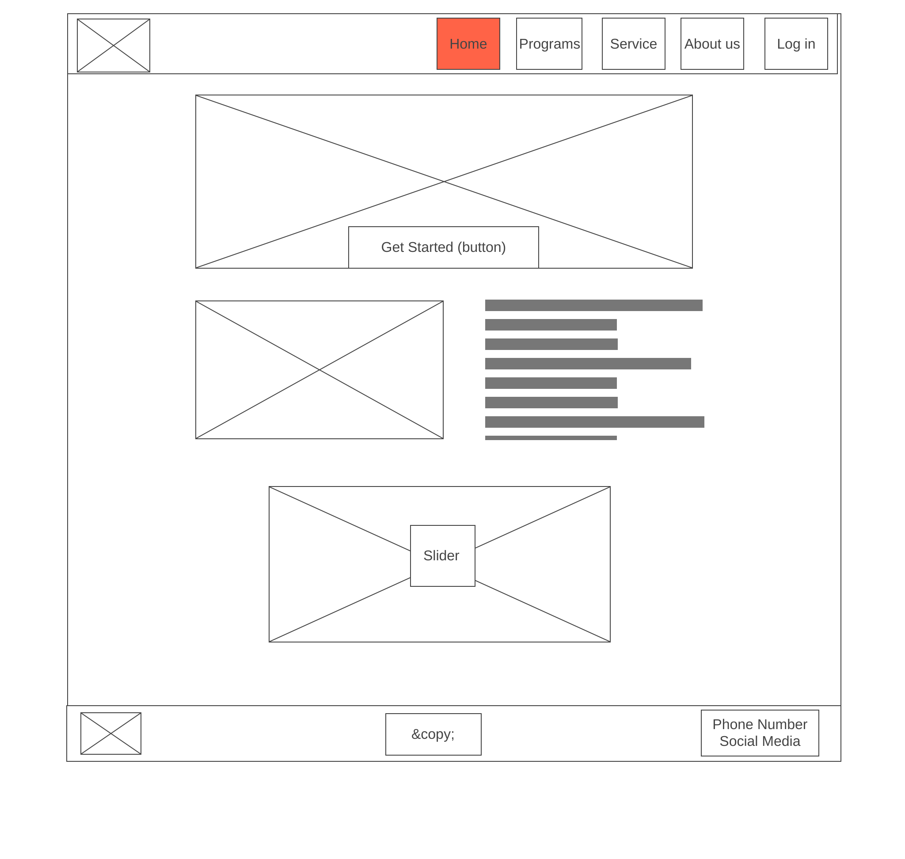
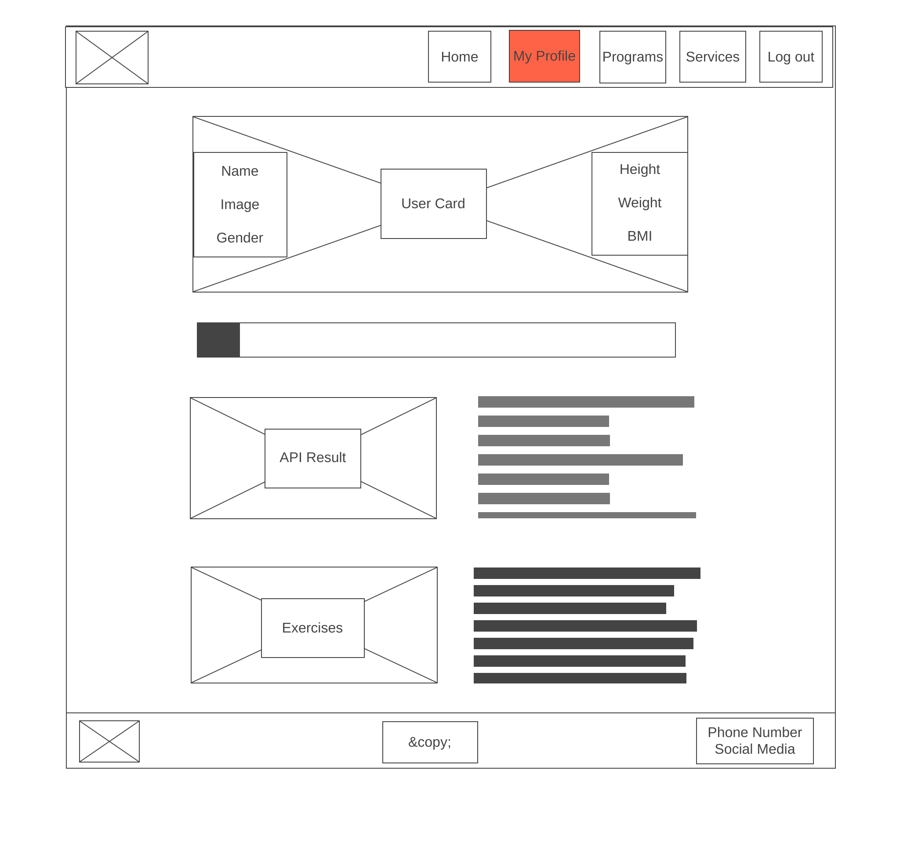
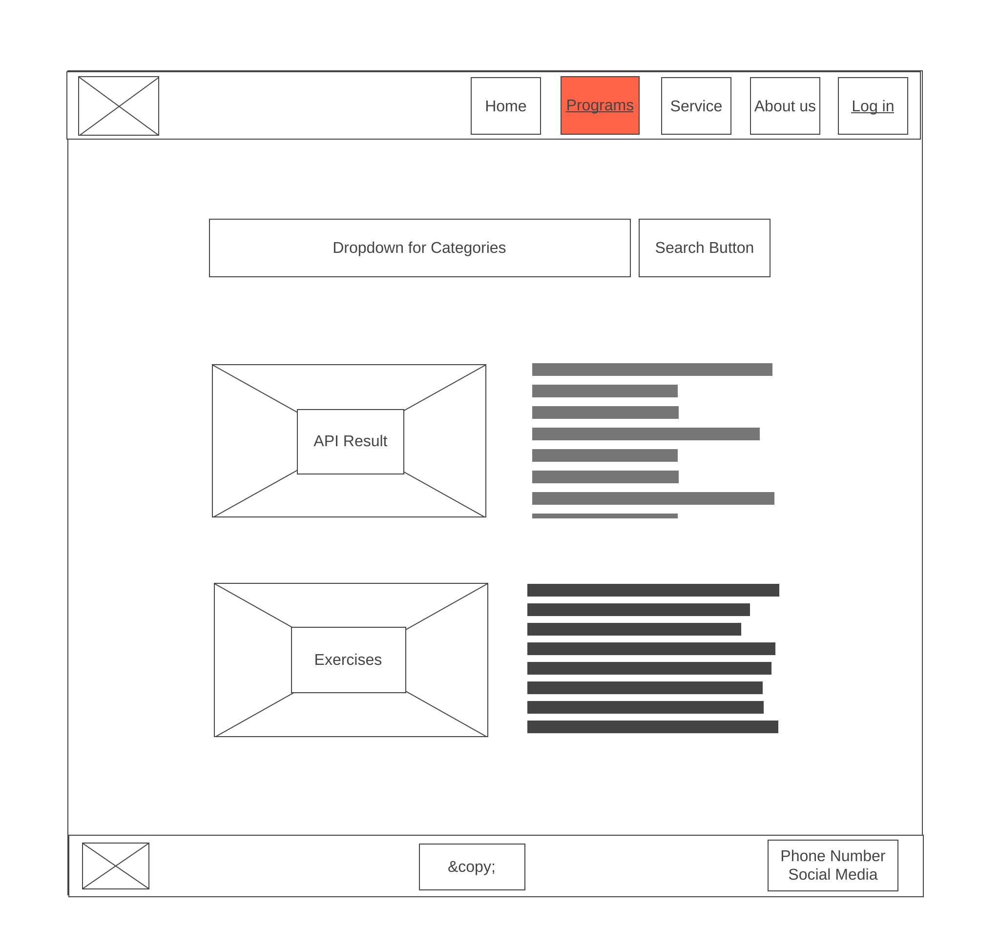
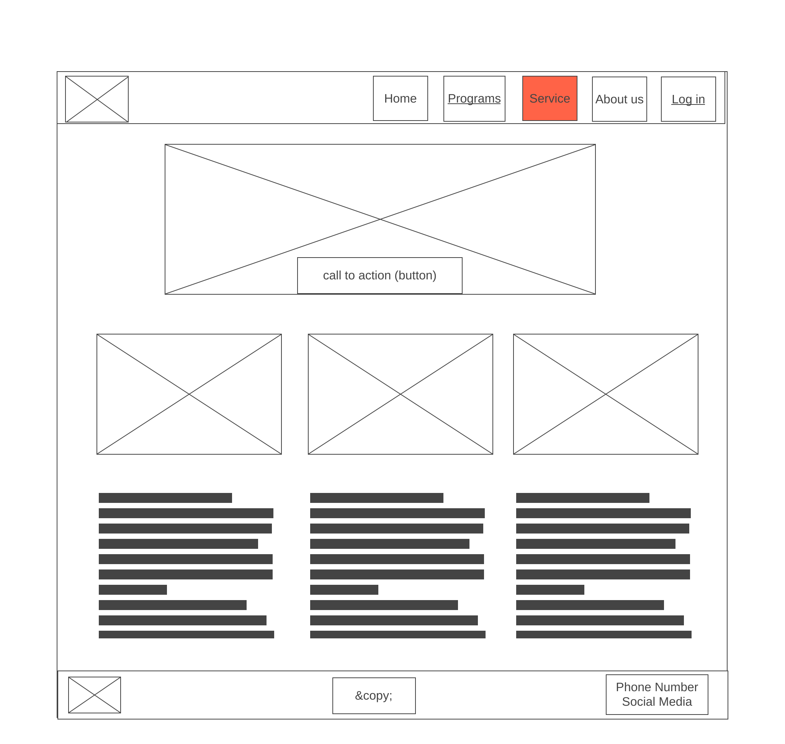
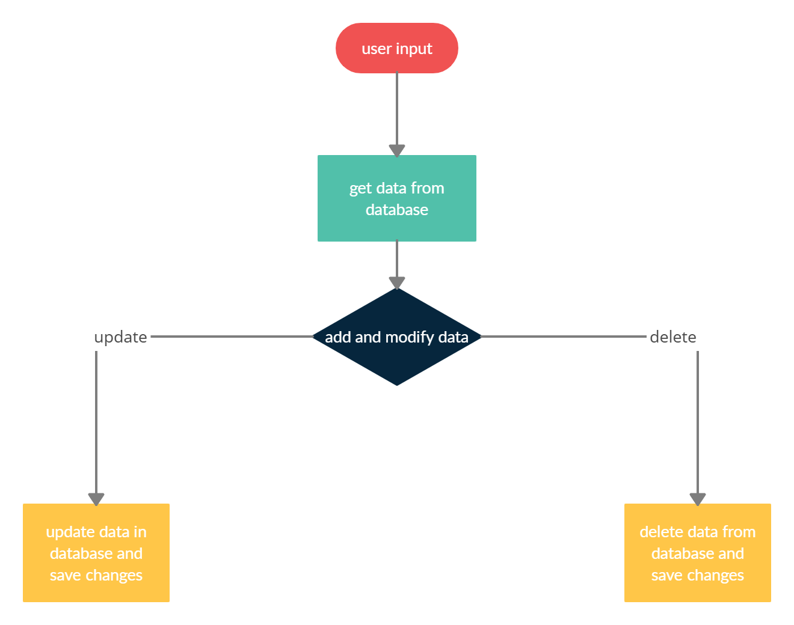
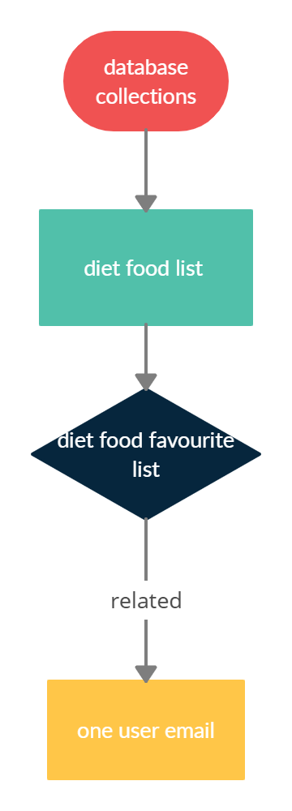

## Nutricare

- An app helps people who want to live a healthy life style

- By offering food and exercise programs

- Every user has a profile after he/she enter data (name, gender, height , weight, ... etc)

- Depends on width and height will calculate BMI for each user... and provide him/her with specific programs....

## Group Members

- Abdelqader Al-Omari
- Hatem Sallam
- Doaa Daban
- Anas Dalala'h
- Ghaida Gharaibeh

## wireframes 

## user stories 

## user story 1

- As an user, I want the ability to create and modify healthy food favourite list .

### Feature Tasks:
- user can choose which type of healthy food to view
- Add/delete/update any type to his/her favourite list
- Save list changes

### Acceptance Tests:
- Ensure that user picked links to the correct foodtype
- Ensure that the favourite list successfully save into database
- Provide error message and abort transaction if system becomes unavailable

## user story 2

- As an user, I want the ability to choose a diet program and modify weight.

### Feature Tasks:
- user can choose which type of diet program to view and create my programs list
- Add/delete programs and update weight.
- Save my programs list changes.

### Acceptance Tests:
- Ensure that user picked links to the correct diet program
- Ensure that the my program list successfully save into database
- Provide error message and abort transaction if system becomes unavailable

## Domain Modeling

## Database Schema Diagram

